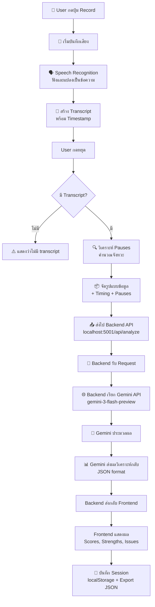

# 🤖 ระบบ AI Speech Analysis - การทำงาน

## 📊 Flow การทำงานทั้งหมด



## 🔍 รายละเอียดแต่ละขั้นตอน

### 1️⃣ การบันทึกเสียง (Recording)

**ไฟล์:** `js/app.js` → `startRecording()`

```javascript
// ขอ permission ไมค์
const stream = await navigator.mediaDevices.getUserMedia({ audio: true });

// เริ่มบันทึก
const recorder = new MediaRecorder(stream);
recorder.start();

// เริ่ม Speech Recognition พร้อมกัน
initializeSpeechRecognition();
```

**ผลลัพธ์:**
- 🎵 ไฟล์เสียง (blob) → เก็บไว้ใน `recordedBlob`
- 📝 Transcript (text) → เก็บไว้ใน `transcript` array

---

### 2️⃣ Speech Recognition (เปลี่ยนเสียง→ข้อความ)

**ไฟล์:** `js/app.js` → `initializeSpeechRecognition()`

```javascript
const recog = new SpeechRecognition();
recog.lang = 'th-TH';
recog.continuous = true;

recog.onresult = (event) => {
    // แปลงเสียงเป็นข้อความ real-time
    const text = event.results[i][0].transcript;
    
    // บันทึกพร้อม timestamp
    transcriptSegments.push({
        text: text,
        startTime: 2.5,  // วินาทีที่เริ่ม
        endTime: 5.0     // วินาทีที่จบ
    });
};
```

**ผลลัพธ์:**
```javascript
[
  { text: "สวัสดีครับ", startTime: 0.0, endTime: 2.0 },
  { text: "ผมชื่อนาย", startTime: 2.0, endTime: 4.5 },
  { text: "เอกประสงค์", startTime: 4.5, endTime: 6.0 }
]
```

---

### 3️⃣ วิเคราะห์ Pauses & Timing

**ไฟล์:** `js/app.js` → `AICoach.analyzeSpeech()`

```javascript
// คำนวณ pause ระหว่าง segments
const pauseDuration = nextSeg.startTime - currentSeg.endTime;

if (pauseDuration > 0.5) {  // หยุดนานกว่า 0.5 วินาที
    pauses.push({
        after: "สวัสดีครับ...",
        duration: 1.2,
        position: "2.0s"
    });
}

// จัดรูปแบบ transcript
const formatted = `
[0.0s-2.0s] สวัสดีครับ
[PAUSE 1.2s]
[3.2s-4.5s] ผมชื่อนาย
`;

// คำนวณสถิติ
const stats = {
    speakingTime: 15.5,    // วินาทีที่พูดจริง
    pauseTime: 4.5,        // วินาทีที่หยุด
    wordsPerMinute: 120    // ความเร็ว
};
```

**ผลลัพธ์:** Transcript พร้อมข้อมูล timing ครบถ้วน

---

### 4️⃣ ส่งไป Backend API

**ไฟล์:** `js/app.js` → `AICoach.analyzeSpeech()`

```javascript
// สร้าง prompt สำหรับ AI
const prompt = `
คุณคือโค้ชสอนการพูดมืออาชีพ วิเคราะห์การพูดต่อไปนี้:

**เนื้อหาที่พูด (มี timestamp):**
[0.0s-2.0s] สวัสดีครับ
[PAUSE 1.2s]
[3.2s-4.5s] ผมชื่อนาย

**สถิติการพูด:**
- เวลาพูดจริง: 15.5s (77%)
- เวลาหยุดพัก: 4.5s (23%)
- ความเร็วเฉลี่ย: 120 คำ/นาที

กรุณาวิเคราะห์และให้ผลลัพธ์เป็น JSON...
`;

// ส่งไป backend
const response = await fetch('http://localhost:5001/api/analyze', {
    method: 'POST',
    headers: { 'Content-Type': 'application/json' },
    body: JSON.stringify({ prompt: prompt })
});
```

---

### 5️⃣ Backend ประมวลผล

**ไฟล์:** `backend/server.py` → `/api/analyze`

```python
@app.route('/api/analyze', methods=['POST'])
def analyze():
    # รับ prompt จาก frontend
    data = request.json
    prompt = data.get('prompt')
    
    # เรียก Gemini API (ใช้ API key จาก .env)
    response = requests.post(
        f'https://generativelanguage.googleapis.com/v1beta/models/gemini-3-flash-preview:generateContent?key={GEMINI_API_KEY}',
        json={
            'contents': [{
                'parts': [{'text': prompt}]
            }]
        }
    )
    
    # ส่งผลลัพธ์กลับ frontend
    return jsonify(response.json())
```

**ทำไมต้องมี Backend?**
- 🔒 **ความปลอดภัย:** API key ซ่อนอยู่ใน backend ไม่ให้ user เห็น
- 🛡️ **CORS:** แก้ปัญหา cross-origin requests
- 📊 **Monitoring:** ดู logs ได้ง่าย

---

### 6️⃣ Gemini AI ประมวลผล

**ที่ Google Cloud:**

```
1. Gemini อ่าน prompt (ข้อความ + timestamp + stats)
2. วิเคราะห์:
   - เนื้อหา (structure, clarity)
   - จังหวะการพูด (pace)
   - การหยุดพัก (pauses)
   - รูปแบบการคิด (cognitive patterns)
3. สร้าง JSON response
```

**ผลลัพธ์ (JSON):**
```json
{
  "sentences": [...],
  "structure": { "score": 7 },
  "pace": {
    "overall": "พอดี",
    "paceScore": 8,
    "paceIssues": ["พูดเร็วในช่วงแรก"]
  },
  "pauses": {
    "totalPauses": 5,
    "pauseScore": 7,
    "appropriatePauses": ["หลังจบประโยค"],
    "inappropriatePauses": ["กลางประโยค"]
  },
  "scores": {
    "fluency": 7,
    "clarity": 8,
    "pace": 8,
    "pauses": 7,
    "overall": 7.5
  },
  "strengths": ["พูดชัดเจน", "มีโครงสร้าง"],
  "improvements": ["ควรหยุดพักน้อยลง"]
}
```

---

### 7️⃣ Frontend แสดงผล

**ไฟล์:** `js/app.js` → UI Components

```javascript
// รับผลจาก API
const feedback = await aiCoach.analyzeSpeech(...);

// แสดงคะแนน
setAiFeedback(feedback);

// แสดง UI:
// - Scores: fluency, clarity, pace, pauses
// - Strengths ✅
// - Improvements ⚠️
// - Next Steps 📝
```

---

## 🎯 สรุปง่ายๆ

| ขั้นตอน | ทำอะไร | ผลลัพธ์ |
|---------|--------|---------|
| 1. Record | บันทึกเสียง + Speech Recognition | เสียง + transcript |
| 2. Analyze Timing | หา pauses + คำนวณความเร็ว | Transcript พร้อม timing |
| 3. Format Prompt | จัดรูปแบบข้อมูล | Prompt สำหรับ AI |
| 4. Send to Backend | ส่งผ่าน API (ซ่อน API key) | Request ไป Gemini |
| 5. Gemini Process | AI วิเคราะห์การพูด | JSON results |
| 6. Display Results | แสดง scores + feedback | UI แสดงผล |

## 💡 จุดสำคัญ

### ✅ ข้อดีของระบบ
- **ปลอดภัย:** API key อยู่ใน backend
- **แม่นยำ:** มี timing + pause detection
- **ครบถ้วน:** วิเคราะห์ทั้งเนื้อหา + จังหวะ
- **Modular:** แก้ไขง่าย แยกไฟล์ชัดเจน

### ⚠️ ข้อจำกัด
- **Speech Recognition:** อาจไม่จับเสียงได้ 100%
- **ภาษาไทย:** Speech Recognition อาจพลาดบางคำ
- **Quota:** Free tier Gemini มีขีดจำกัด
- **Text-based:** AI วิเคราะห์จาก text ไม่ใช่เสียงจริง

## 🔧 ไฟล์ที่เกี่ยวข้อง

```
Speaking_improve/
├── js/app.js              ← หัวใจของระบบ (1,721 lines)
│   ├── startRecording()         → เริ่มบันทึก
│   ├── initializeSpeechRecognition() → แปลงเสียง→ข้อความ
│   ├── AICoach.analyzeSpeech()  → วิเคราะห์ + ส่ง API
│   └── UI Components            → แสดงผล
│
├── backend/server.py      ← API Proxy
│   └── /api/analyze       → รับ prompt, เรียก Gemini
│
└── backend/.env           ← API Key (ปลอดภัย!)
    ├── GEMINI_API_KEY
    └── GEMINI_MODEL=gemini-3-flash-preview
```

---

ถ้าอยากดู code จริงๆ ตรงไหนเพิ่มเติมบอกได้เลยครับ! 🚀
